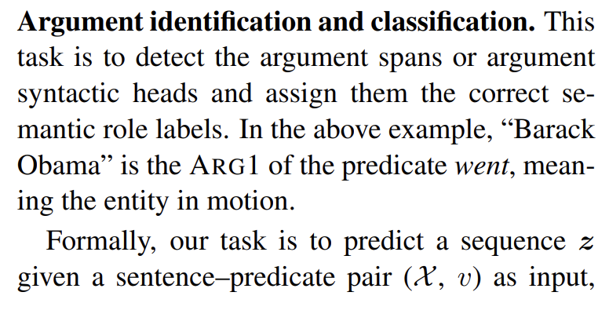
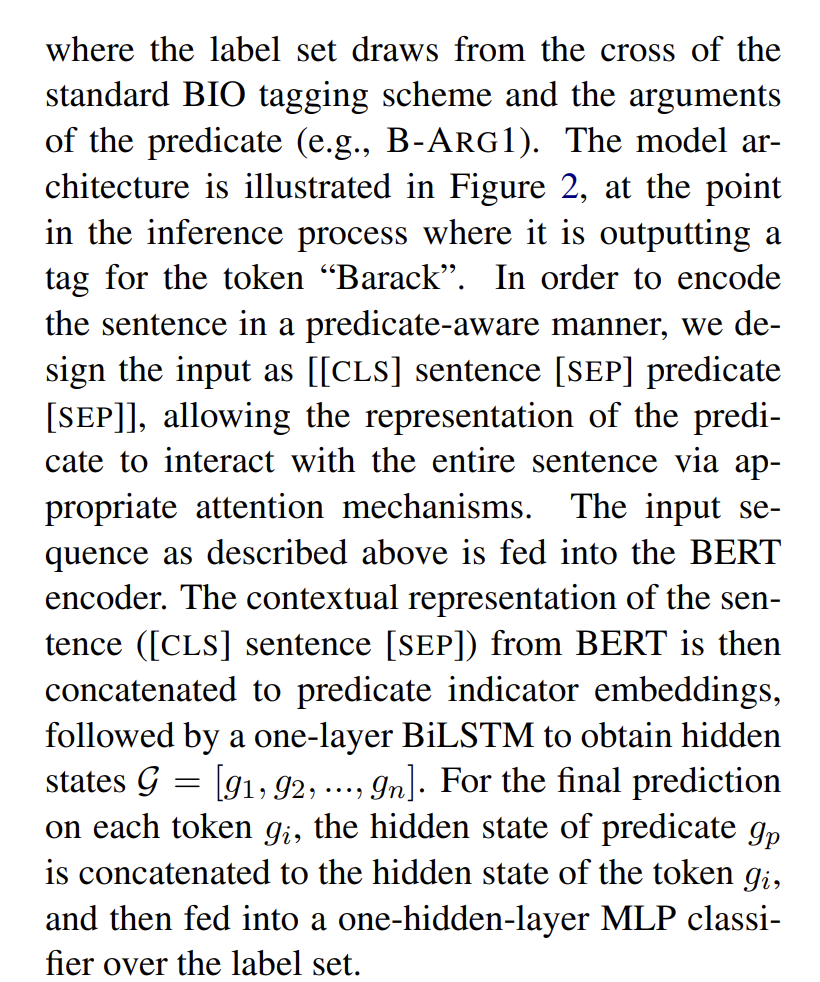
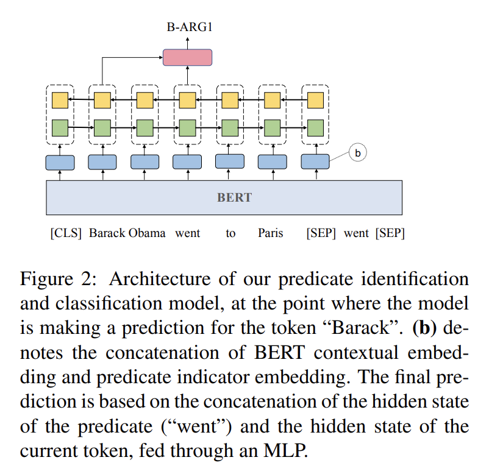
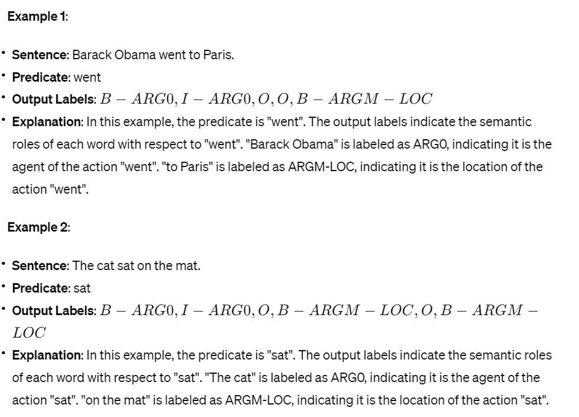
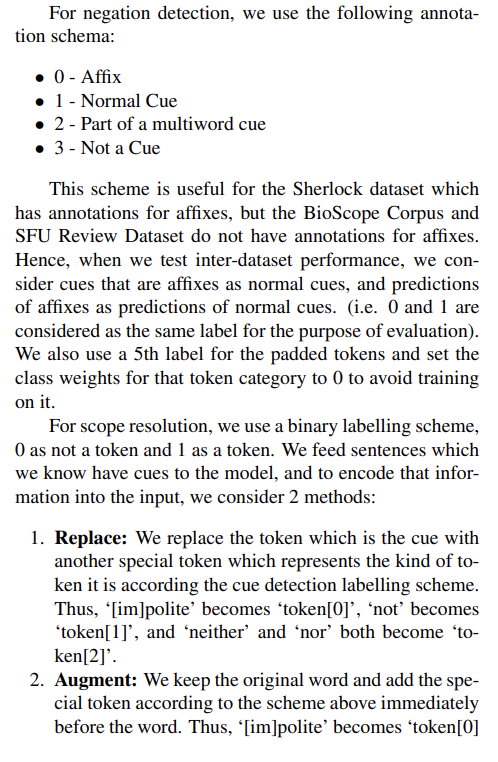
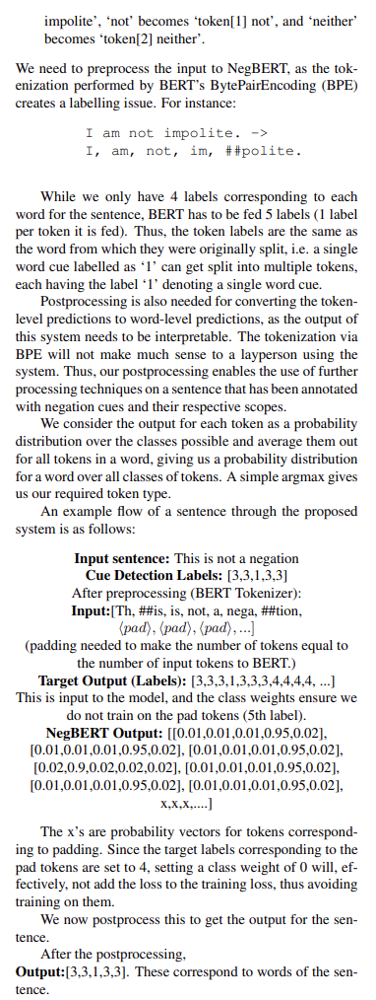

# Assignment 3
- fine-tune BERT to detect and label arguments in a single step
- use Universal Proposition Bank for English as training and test data
- challenge: represent the relation between the sentence and the predicate under consideration
- do not use span labels, simply work with the token labels in the data
## 1. BERT Models
### Baseline Models
- predict the correct argument labels for each token in a sentence given a particular predicate in the sentence
- n label the tokens in a sentence with respect to a particular predicate
- [link](https://arxiv.org/pdf/1904.05255.pdf)
- https://odsc.medium.com/what-happens-when-you-run-srl-experiments-over-a-bert-based-model-e54cc4501f63

### Advanced Models
- [link1](http://www.lrec-conf.org/proceedings/lrec2020/pdf/2020.lrec-1.704.pdf)
- [link2](https://aclanthology.org/P15-1109.pdf)

### Evaluation

## 2. Steps
- Extracting the data from the CoNLL format and converting it to a BERT input format (one instance is a sentence-predicate combination)
- Creating input for the BERT model (baseline + advanced model)
- Finetuning your models (using the training split)
- Evaluation of your models on the test split